---
## Front matter
title: "Отчет по Лабораторной работе №5"
subtitle: "Архитектура компьютера"
author: "Чернятьева Олеся Олеговна"

## Generic otions
lang: ru-RU
toc-title: "Содержание"

## Bibliography
bibliography: bib/cite.bib
csl: pandoc/csl/gost-r-7-0-5-2008-numeric.csl

## Pdf output format
toc: true # Table of contents
toc-depth: 2
lof: true # List of figures
lot: true # List of tables
fontsize: 12pt
linestretch: 1.5
papersize: a4
documentclass: scrreprt
## I18n polyglossia
polyglossia-lang:
  name: russian
  options:
	- spelling=modern
	- babelshorthands=true
polyglossia-otherlangs:
  name: english
## I18n babel
babel-lang: russian
babel-otherlangs: english
## Fonts
mainfont: PT Serif
romanfont: PT Serif
sansfont: PT Sans
monofont: PT Mono
mainfontoptions: Ligatures=TeX
romanfontoptions: Ligatures=TeX
sansfontoptions: Ligatures=TeX,Scale=MatchLowercase
monofontoptions: Scale=MatchLowercase,Scale=0.9
## Biblatex
biblatex: true
biblio-style: "gost-numeric"
biblatexoptions:
  - parentracker=true
  - backend=biber
  - hyperref=auto
  - language=auto
  - autolang=other*
  - citestyle=gost-numeric
## Pandoc-crossref LaTeX customization
figureTitle: "Рис."
tableTitle: "Таблица"
listingTitle: "Листинг"
lofTitle: "Список иллюстраций"
lotTitle: "Список таблиц"
lolTitle: "Листинги"
## Misc options
indent: true
header-includes:
  - \usepackage{indentfirst}
  - \usepackage{float} # keep figures where there are in the text
  - \floatplacement{figure}{H} # keep figures where there are in the text
---

# Цель работы
Целью данной лабораторной работы является приобретение практических навыков работы в Midnight Commander и освоение инструкций языка ассемблера mov,int.

                                                                              |

# Выполнение лабораторной работы

Открываю Midnight Commander, введя mc(рис. @fig:001).

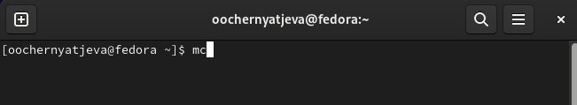{#fig:001 width=70%}

Перехожу в каталог ~/work/arch-pc(рис. [-@fig:003])

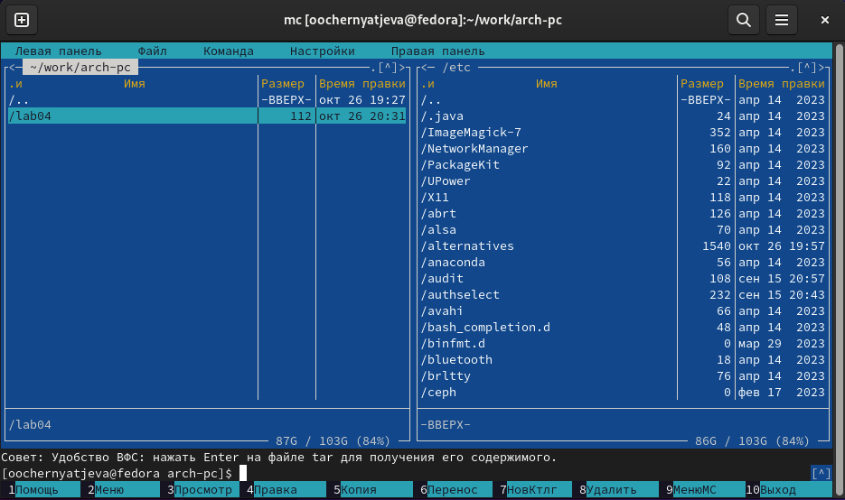{#fig:003 width=70%}

Создаю каталог lab05 с помощью клавиши F7(рис. [-@fig:004]).

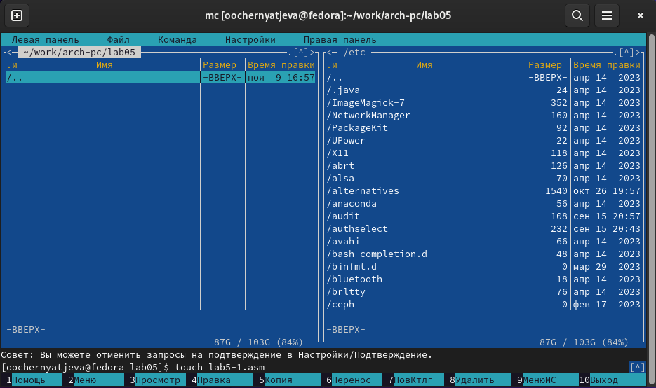{#fig:004 width=70%}

Пользуясь строкой ввода и командой touch создала файл lab5-1.asm(рис. [-@fig:024]).

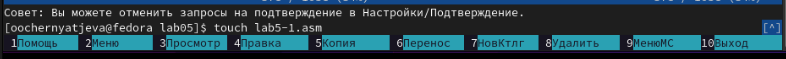{#fig:024 width=70%}

С помощью функциональной клавиши F4 открыла файл lab5-1.asm для редактирования во встроенном редакторе nano. 
Ввела текст программы из листинга(рис. [-@fig:005]).

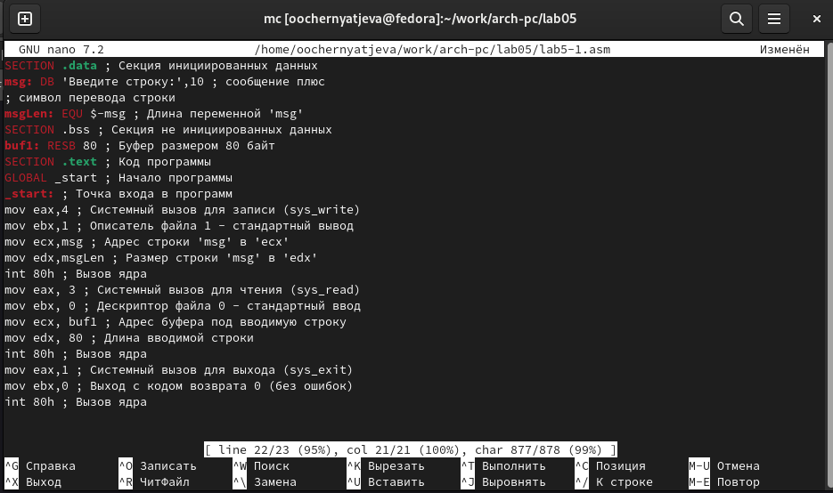{#fig:005 width=70%}

С помощью функциональной клавиши F3 открыла файл lab5-1.asm для просмотра.
Убедилась, что файл содержит текст программы(рис. [-@fig:006]).

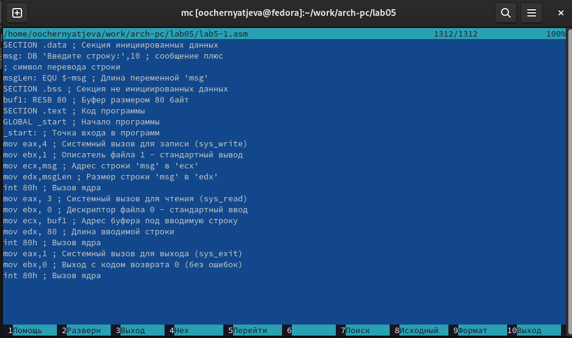{#fig:006 width=70%}

Оттранслировала текст программы lab5-1.asm в объектный файл. Выполнила компоновку объектного файла и запустила получившийся исполняемый файл(рис. [-@fig:007]).

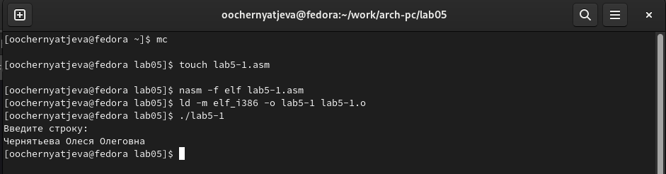{#fig:007 width=70%}

Скачала файл in_out.asm со страницы курса в ТУИС (сохранился в каталоге "Загрузки")(рис. [-@fig:008]).

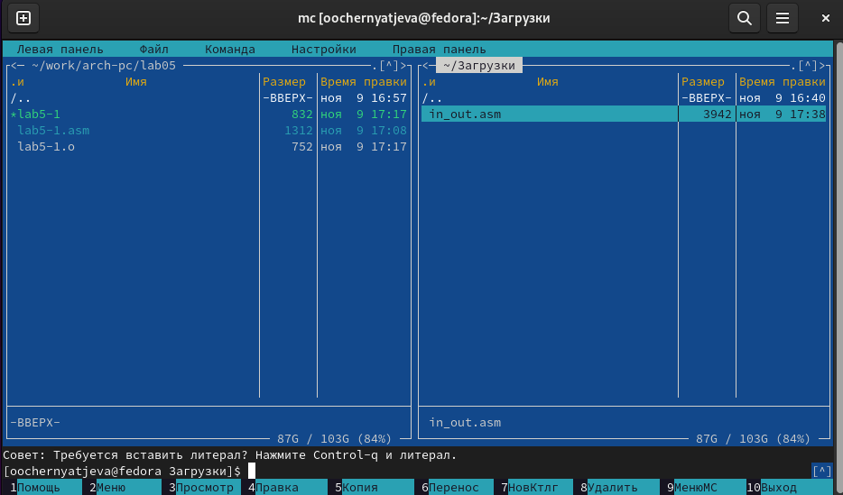{#fig:008 width=70%}

Скопировала файл in_out.asm из каталога "Загрузки" в созданный каталог lab05 с помощью клавиши F5(рис. [-@fig:026]).

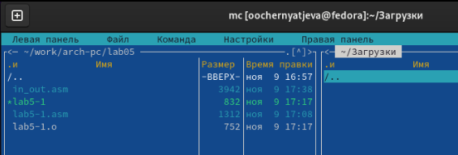{#fig:026 width=70%}

Создала копию файла lab5-1.asm с именем lab5-2.asm(рис. [-@fig:011]).

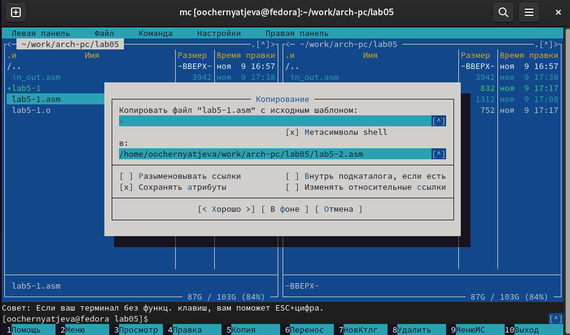{#fig:011 width=70%}

Изменила содержимое файла lab5-2.asm во встроенном редакторе nano, чтобы были использованы подпрограммы 
из внешнего файла in_out.asm(рис. [-@fig:012]).

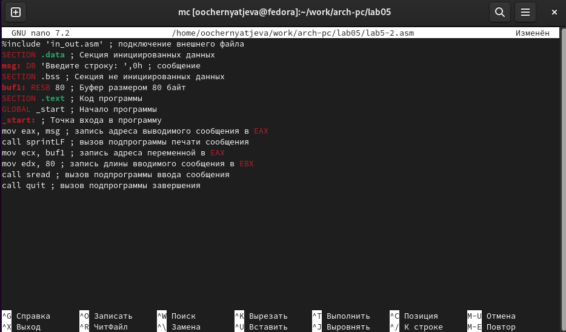{#fig:012 width=70%}

Транслирую текст программы файла в объектный файл; создался объектный файл; выполняю компоновку объектного файла;
создался исполняемый файл; запускаю исполняемый файл

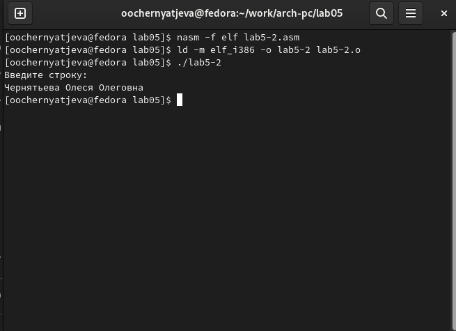{#fig:013 width=70%}

В файле lab5-2.asm заменила подпрограмму sprintLF на sprint(рис. [-@fig:014]).

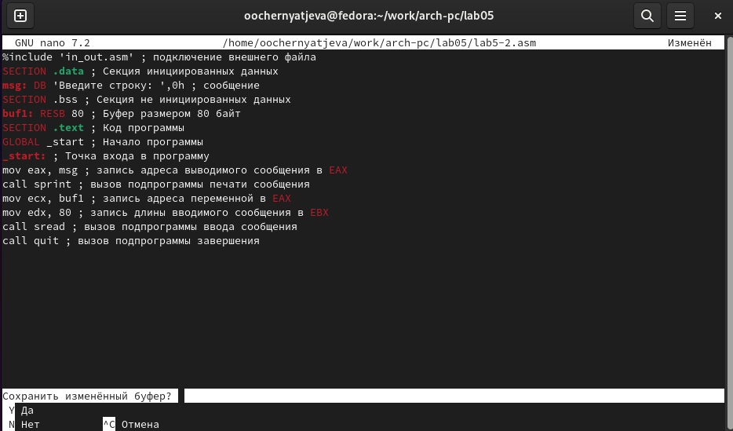{#fig:014 width=70%}

Создала исполняемый файл и проверила его работу(использую подпрограмму sprintLF запрашивается ввод с новой строки,а при sprint  запрашивается ввод без переноса на новую строку)(рис. [-@fig:015]).

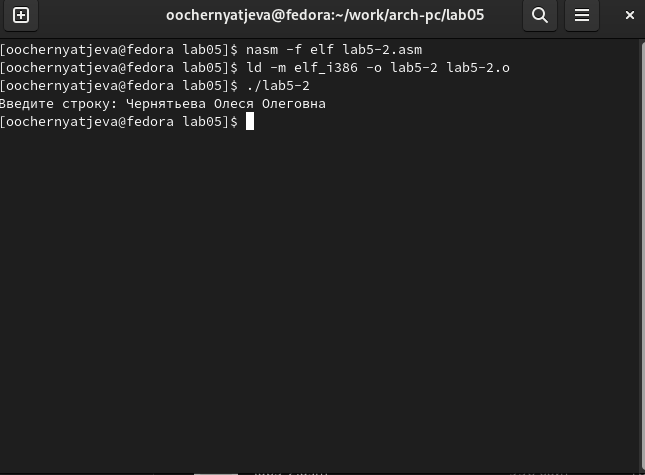{#fig:015 width=70%}

# Выполнения задания для самостоятельной работы

Создала копию файла lab5-1.asm с именем lab5-1-1.asm(рис. [-@fig:016]).

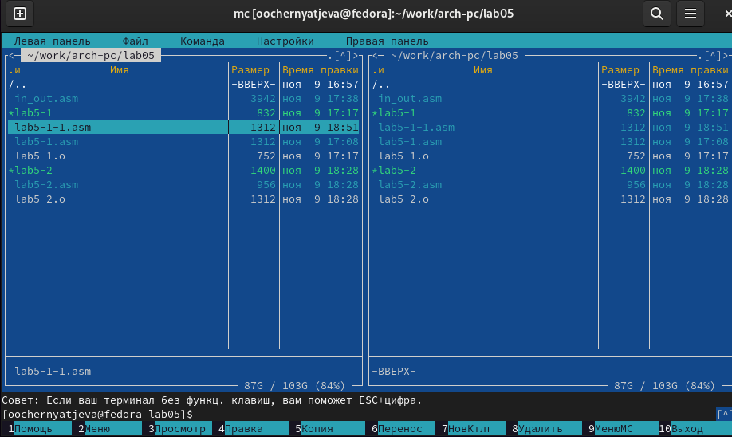{#fig:016 width=70%}

С помощью функциональной клавиши F4 открываю созданный файл для редактирования. 
Изменяю программу так, чтобы кроме вывода приглашения и запроса ввода, она выводила вводимую пользователем строку(рис. [-@fig:017]).

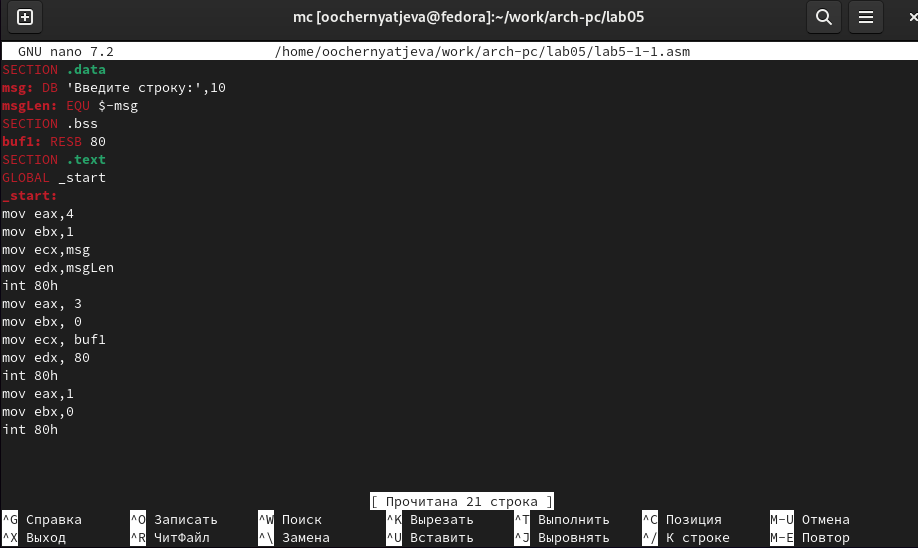{#fig:017 width=70%}

Создаю объектный файл lab6-1-1.o, отдаю его на обработку компоновщику, получаю исполняемый файл lab6-1-1, запускаю полученный исполняемый файл. 
Программа запрашивает ввод, ввожу свои ФИО, далее программа выводит введенные мною данные(рис. [-@fig:028]). 

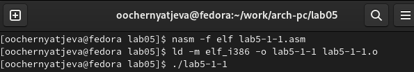{#fig:028 width=70%}

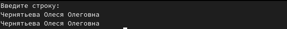{#fig:029 width=70%} 

Создаю копию файла lab5-2.asm с именем lab5-2-1.asm с помощью функциональной клавиши F5(рис. [-@fig:019]). 

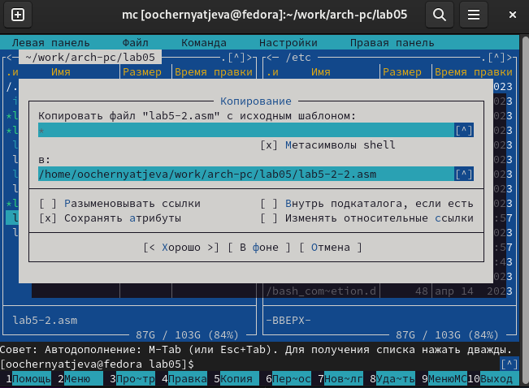{#fig:019 width=70%}

С помощью функциональной клавиши F4 открываю созданный файл для редактирования. Изменяю программу так, 
чтобы кроме вывода приглашения и запроса ввода, она выводила вводимую пользователем строку(рис. [-@fig:020]). 

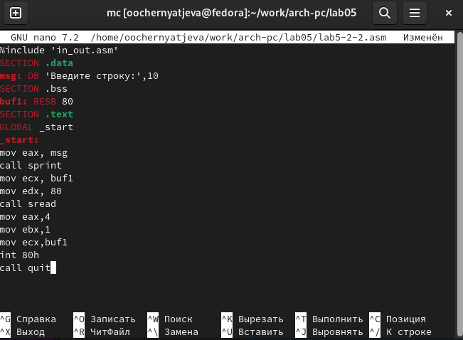{#fig:020 width=70%}

Создаю объектный файл lab5-2-2.o, отдаю его на обработку компоновщику, получаю исполняемый файл lab5-2-2, запускаю полученный исполняемый файл. 
Программа запрашивает ввод без переноса на новую строку, ввожу свои ФИО, далее программа выводит введенные мною данные(рис. [-@fig:022]).  

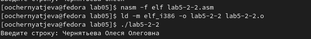{#fig:022 width=70%}

# Выводы

При выполнении лабораторной работы №5 я приобрела практические навыки работы в Midnight Commander и освоила инструкции языка ассемблера mov,int.

