---
## Front matter
title: "Отчет по выполнению лабораторной работы №8"
subtitle: "Дисциплина: архитектура компьютеров"
author: "Чернятьева Олеся Олеговна"

## Generic otions
lang: ru-RU
toc-title: "Содержание"

## Bibliography
bibliography: bib/cite.bib
csl: pandoc/csl/gost-r-7-0-5-2008-numeric.csl

## Pdf output format
toc: true # Table of contents
toc-depth: 2
lof: true # List of figures
lot: true # List of tables
fontsize: 12pt
linestretch: 1.5
papersize: a4
documentclass: scrreprt
## I18n polyglossia
polyglossia-lang:
  name: russian
  options:
	- spelling=modern
	- babelshorthands=true
polyglossia-otherlangs:
  name: english
## I18n babel
babel-lang: russian
babel-otherlangs: english
## Fonts
mainfont: PT Serif
romanfont: PT Serif
sansfont: PT Sans
monofont: PT Mono
mainfontoptions: Ligatures=TeX
romanfontoptions: Ligatures=TeX
sansfontoptions: Ligatures=TeX,Scale=MatchLowercase
monofontoptions: Scale=MatchLowercase,Scale=0.9
## Biblatex
biblatex: true
biblio-style: "gost-numeric"
biblatexoptions:
  - parentracker=true
  - backend=biber
  - hyperref=auto
  - language=auto
  - autolang=other*
  - citestyle=gost-numeric
## Pandoc-crossref LaTeX customization
figureTitle: "Рис."
tableTitle: "Таблица"
listingTitle: "Листинг"
lofTitle: "Список иллюстраций"
lotTitle: "Список таблиц"
lolTitle: "Листинги"
## Misc options
indent: true
header-includes:
  - \usepackage{indentfirst}
  - \usepackage{float} # keep figures where there are in the text
  - \floatplacement{figure}{H} # keep figures where there are in the text
---

# Цель работы

Приобретение навыков написания программ с использованием циклов и обработкой
аргументов командной строки.

# Задание
1. Реализация циклов в NASM
2. Обработка аргументов командной строки

# Выполнение лабораторной работы

## Реализация циклов в NASM

Создаю каталог для программ лабораторной работы №8, перехожу в него и создаю файл lab8-1.asm (рис. [-@fig:001]).

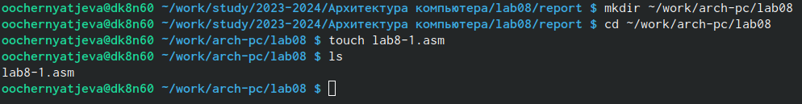{#fig:001 width=70%}

Ввожу в файл lab8-1.asm текст программы из листинга 8.1.(рис. [-@fig:002]).

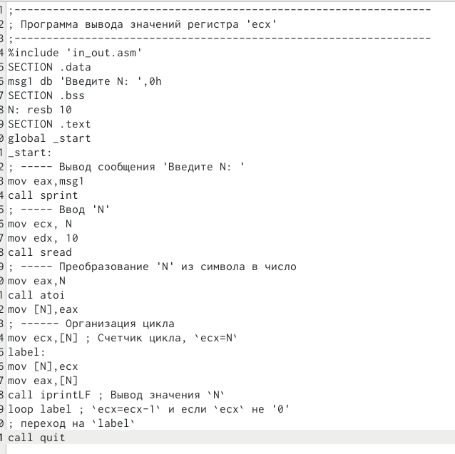{#fig:002 width=70%}

Созаю исполняемый файл и проверяю его работу.(рис. [-@fig:003]).

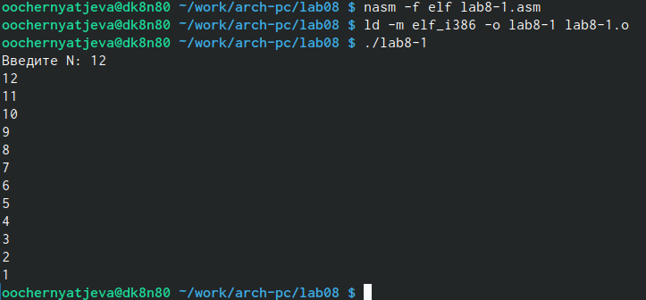{#fig:003 width=70%}

Далее изменяю текст программы, добавив изменение значение регистра ecx в цикле.(рис. [-@fig:004]).

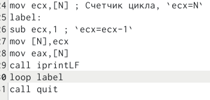{#fig:004 width=70%}

Создаю исполняемый файл и проверяю его работу.(рис. [-@fig:005]).

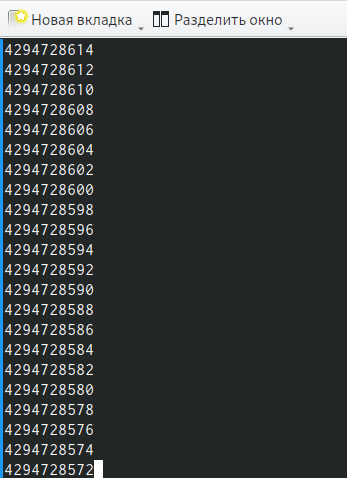{#fig:005 width=70%}

В этой программе число проходов цикла не соответствует значению N.

Вношу изменения в текст программы, добавив команды push и pop.(рис. [-@fig:006]).

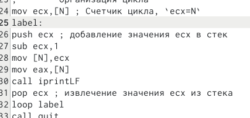{#fig:006 width=70%}

Создаю исполняемый файл и запускаю его.(рис. [-@fig:007]).

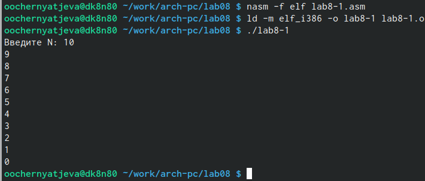{#fig:007 width=70%}

В данном случае число проходов цикла соответствует значению N.

## Обработка аргументов командной строки 

Создаю файл lab8-2.asm.(рис. [-@fig:008]).

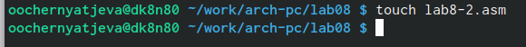{#fig:008 width=70%}

Ввожу в него программу из листинга 8.2.(рис. [-@fig:009]).

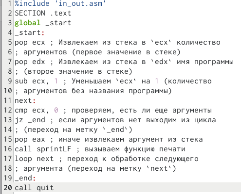{#fig:009 width=70%}

Создаю исполняемый файл и запускаю его, указав аргументы "12", "39" и "1".(рис. [-@fig:010]).

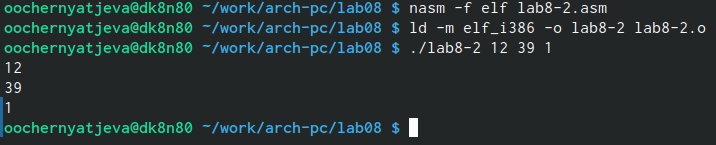{#fig:010 width=70%}

Программой было обработано 3 аргумента.

Создаю файл lab8-3.asm и ввожу в него программу из листинга 8.3.(рис. [-@fig:011]).

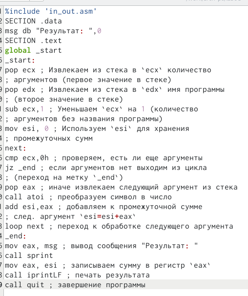{#fig:011 width=70%}

Созадю исполняемый файл и запускаю его, указав аргументы.(рис. [-@fig:002]).

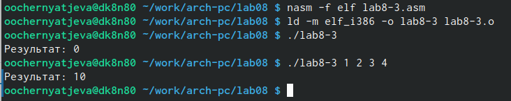{#fig:012 width=70%}

Программа работает.

Теперь изменяю текст программы из листинга 8.3 так, чтобы он вычислял произведение агрументов каждой строки.(рис. [-@fig:013]).

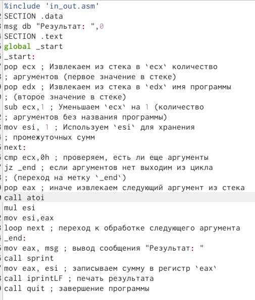{#fig:013 width=70%}

Создаю исполняемый файл и запускаю его, указав аргументы.(рис. [-@fig:114]).

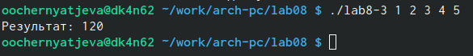{#fig:114 width=70%}

#Задания для самостоятельной работы

Создаю файл lab8-4.asm и начинаю написание программы, которая находит сумму значений функии f(x) для своео варианта(вариант 16).(рис. [-@fig:015]).

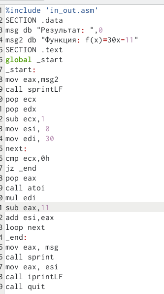{#fig:015 width=70%}

Создаю исполняемый файл и запускаю его, указав агрументы.(рис. [-@fig:014]).

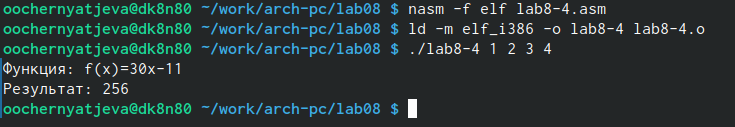{#fig:014 width=70%}

Программы работает корректно.

Текст прогораммы:

%include 'in_out.asm'  
SECTION .data  
msg db "Результат: ",0  
msg2 db "Функция: f(x)=30x-11"  
SECTION .text  
global _start  
_start:  
mov eax,msg2  
call sprintLF  
pop ecx   
pop edx   
sub ecx,1   
mov esi, 0   
mov edi, 30  
next:  
cmp ecx,0h  
jz _end  
pop eax  
call atoi  
mul edi  
sub eax,11  
add esi,eax  
loop next   
_end:  
mov eax, msg   
call sprint  
mov eax, esi   
call iprintLF   
call quit  

# Выводы

После выполнения данной лабораторной работы я научилась написанию программ с исползованием циклов и обработкой аргументов командной строки.

